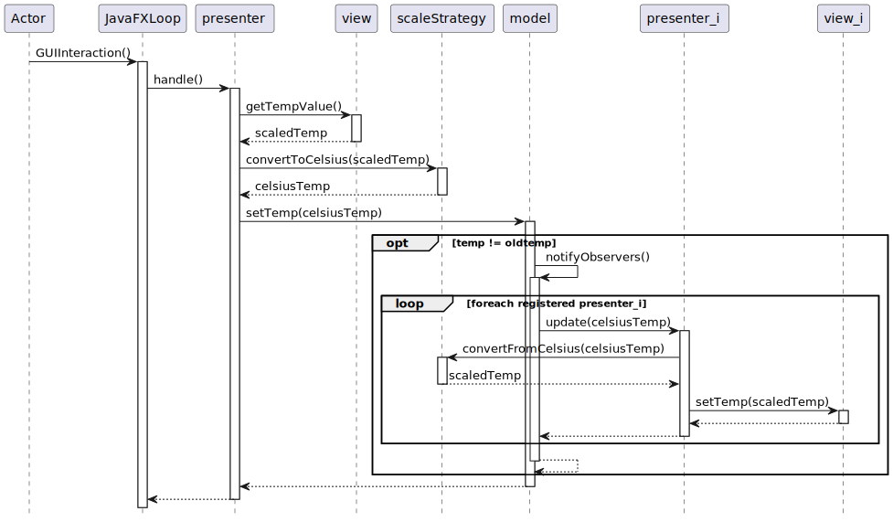

# CORSO INGEGNERIA DEL SOFTWARE A.A. 2022/23

## LABORATORIO TEMPERATURE CONVERTER

* STUDENTE: GEGA Martin

* DOCENTE: BELLETTINI Carlo, MONGA Mattia

### Modello MVP

### Requisiti informali

Il progetto deve tener conto dei seguenti requisiti:

* Le viste ci permettono di leggere e di impostare la temperatura usando diverse scale (unità di misura). Sono richieste 2 viste:
  (1) un [TextField](https://openjfx.io/javadoc/17/javafx.controls/javafx/scene/control/TextField.html) in gradi Celsius, (2) un [TextField](https://openjfx.io/javadoc/17/javafx.controls/javafx/scene/control/TextField.html) in gradi Fahrenheit.

* Una componente aderente alla interfaccia `Model` si occupa di mantenere il dato *temperatura*
  tramite un `double` che rappresenta la misura in gradi Celsius. È unica e
  comune a tutte le viste. Il `Model` a fronte di un cambiamento della
  temperatura, deve occuparsi di *notificare* tutti i `Presenter` a lui registrati.
  Internamente mantiene le temperature secondo la scala Celsius. Il `Model` deve essere capace di gestire sia una comunicazione con approccio *pull* che *push*.

* Una componente aderente alla interfaccia `Presenter` sta nel mezzo tra `View` e `Model` ed
  interpreta l’input dell’utente (l’inserimento di un valore nel `TextField`).
  Un'istanza di `Presenter` (una per ogni vista) a fronte dell'interazione
  dell'utente deve aggiornare il `Model` con la nuova temperatura appena
  immessa.
  Inoltre deve essere in grado di *osservare* un cambiamento di temperatura nel
  termostato in modo da aggiornare valore mostrato all'utente dalla vista a lui collegata.

* Per quanto riguarda i `Presenter`: l'approccio usato nel diagramma di sequenza prevede una classe unica (`TemperaturePresenter`). Le due strategie `CelsiusScale` e `FahrenheitScale` possono essere realizzate usando il pattern  `Singleton`.

Sono già fornite come codice:
* le interfacce `Model`, `Presenter`, `View`, `Observable` e `Observer`.
* la classe `MyTextView` (completa).
* la classe `Main` parzialmente da completare.
* le classi di test per `TemperatureModel` (nel source set `test`) e per il sistema una volta completato (nel source set `integrationTest`).
